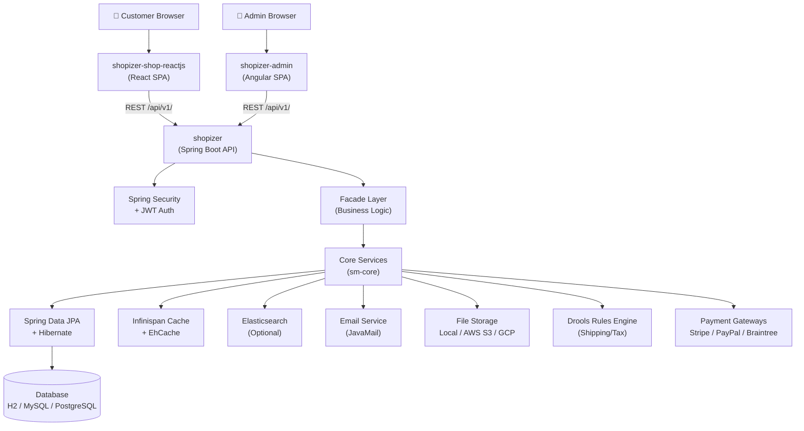
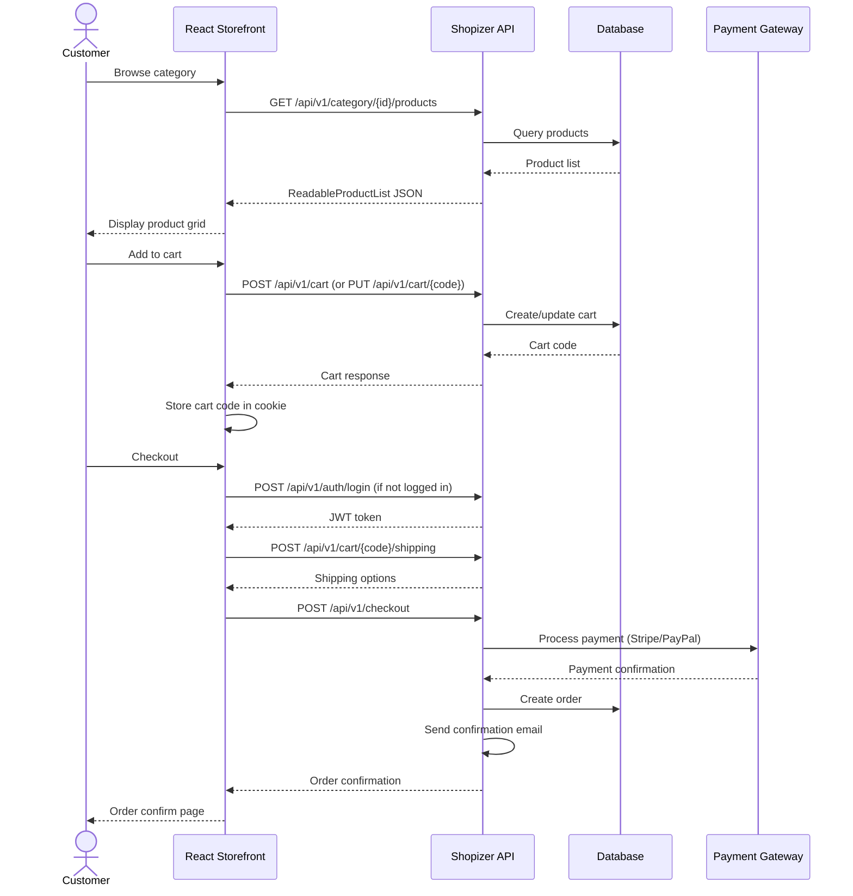
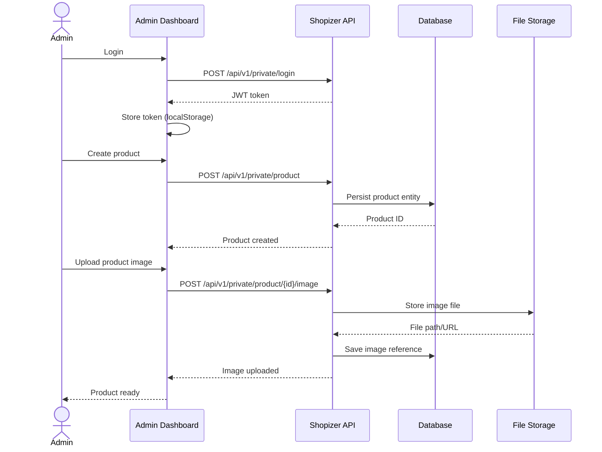
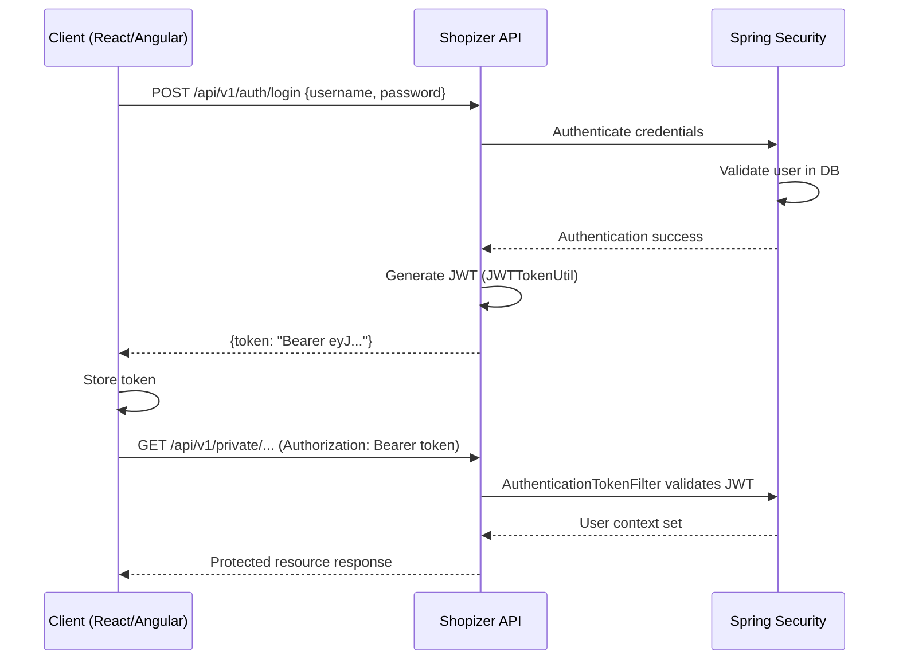
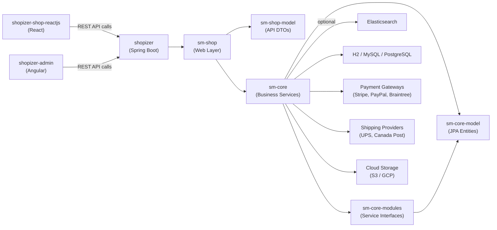
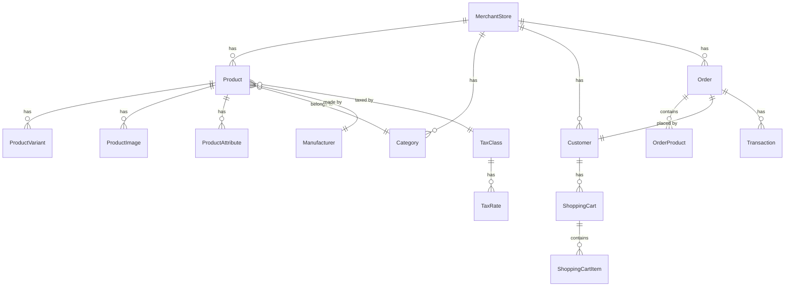

# SYSTEM ARCHITECTURE ANALYSIS
> Generated: 2026-03-11 | Shopizer E-Commerce Platform

---

## SECTION 1 — Executive Summary

**Shopizer** is a full-stack, open-source e-commerce platform built around a Java/Spring Boot REST API backend with two separate frontend clients — a customer-facing React storefront and an Angular-based merchant admin panel.

### What the system does
It enables merchants to run an online store: manage products, categories, inventory, pricing, taxes, shipping, payments, and orders. Customers can browse products, add to cart, checkout, and manage their accounts. Admins manage the entire store configuration through a rich dashboard.

### Primary Purpose
A multi-tenant, multi-store e-commerce engine with REST API-first design, supporting STANDARD, B2B, and MARKETPLACE operating modes.

### Major Components

| Component | Role |
|---|---|
| `shopizer` (Java) | Core backend — REST API, business logic, data persistence |
| `shopizer-shop-reactjs` | Customer-facing storefront SPA |
| `shopizer-admin` (Angular) | Merchant/admin management dashboard |

---

## SECTION 2 — Repository Inventory

| Repo Name | Purpose | Primary Language | Frameworks | Key Responsibilities |
|---|---|---|---|---|
| `shopizer` | Backend REST API + business logic | Java 11 | Spring Boot 2.5, Spring Security, Hibernate/JPA, Drools | Products, orders, customers, payments, shipping, tax, auth, search |
| `shopizer-shop-reactjs` | Customer storefront SPA | JavaScript (ES6) | React 16, Redux, React Router, Axios, Bootstrap 4 | Browse products, cart, checkout, account management |
| `shopizer-admin` | Admin/merchant dashboard SPA | TypeScript | Angular 11, Nebular UI, NgRx, Bootstrap 4 | Store config, catalogue, orders, users, shipping, tax, content |

---

## SECTION 3 — High Level Architecture



### Diagram Explanation

- Both frontend SPAs communicate exclusively via the Shopizer REST API (`/api/v1/`).
- The API layer uses JWT-based authentication with separate token flows for customers and admin users.
- The Facade layer acts as an orchestration layer between REST controllers and core services.
- Core services (`sm-core`) handle all business logic, persistence, caching, search, email, and integrations.
- The database defaults to H2 (embedded, for dev/docker) and supports MySQL and PostgreSQL in production.
- Drools rules engine handles dynamic shipping and tax calculations.
- File storage is pluggable: local filesystem, AWS S3, or Google Cloud Storage.

---

## SECTION 4 — Functional Breakdown

---

### Repo: `shopizer`

**Purpose:** The central backend of the platform. Exposes a versioned REST API consumed by both frontends. Handles all business logic, data persistence, security, and third-party integrations.

**Key Features:**
- Multi-store / multi-merchant support (STANDARD, B2B, MARKETPLACE modes)
- Product catalogue with variants, options, option sets, pricing, inventory
- Shopping cart and checkout flow
- Order management with payment processing
- Customer registration, authentication, address management
- Shipping configuration (Canada Post, UPS, ShipRocket, weight-based, custom rules)
- Tax classes and rates
- Content management (pages, boxes, banners, promotions)
- Search with Elasticsearch integration
- JWT-based auth for both admin users and customers
- Email notifications (order confirmation, password reset, etc.)
- File/image upload with pluggable storage backends
- GeoIP-based location detection

**External Dependencies:**
- Stripe, PayPal, Braintree, Paytm (payment)
- Canada Post, UPS, ShipRocket (shipping)
- Elasticsearch (search)
- AWS S3 / GCP Storage (file storage)
- MaxMind GeoIP2 (geo-location)
- Google Maps API

**Services it communicates with:** All communication is inbound (REST API). Outbound to payment gateways, shipping providers, email servers, and cloud storage.

**Important Folders/Modules:**

| Module | Description |
|---|---|
| `sm-core-model` | JPA entity definitions (domain model) |
| `sm-core-modules` | Business service interfaces |
| `sm-core` | Business service implementations, Spring config, rules, templates |
| `sm-shop-model` | REST API request/response DTOs |
| `sm-shop` | Spring Boot application, REST controllers, facades, security, mappers |

Within `sm-shop/src/main/java/com/salesmanager/shop/`:

| Package | Role |
|---|---|
| `store/api/v1/` | REST controllers (versioned endpoints) |
| `store/facade/` | Facade implementations (orchestration) |
| `store/security/` | JWT auth, Spring Security config |
| `mapper/` | MapStruct mappers (entity ↔ DTO) |
| `populator/` | Legacy populators (entity ↔ DTO, older pattern) |
| `application/config/` | Spring Boot configuration classes |
| `filter/` | CORS filter, XSS filter |
| `init/` | Data initialization on startup |

---

### Repo: `shopizer-shop-reactjs`

**Purpose:** Customer-facing storefront. A React SPA that lets shoppers browse products, manage a cart, checkout, and manage their account.

**Key Features:**
- Product listing by category with filtering (color, size, manufacturer, price)
- Product detail page with image gallery, variants, add-to-cart
- Shopping cart with quantity management
- Checkout with shipping address, payment (Stripe integration)
- Customer registration, login, forgot/reset password
- My Account: profile, order history, order details
- Product search with autocomplete
- CMS content pages
- Multi-language support (English, French)
- Cookie consent
- PWA service worker

**External Dependencies:**
- Axios (HTTP client)
- Redux + redux-thunk (state management)
- React Router (routing)
- Stripe React SDK (payments)
- Bootstrap 4 (styling)
- Swiper (carousels)
- Google Maps React (contact page map)

**Services it communicates with:** `shopizer` REST API at `APP_BASE_URL/api/v1/`

**Important Folders:**

| Folder | Role |
|---|---|
| `src/pages/` | Page-level components (Home, Category, ProductDetail, Cart, Checkout, MyAccount, etc.) |
| `src/components/` | Reusable UI components (header, footer, product cards, modals) |
| `src/wrappers/` | Higher-order wrapper components for sections |
| `src/redux/` | Redux store: actions and reducers (cart, product, user, store, content, loader) |
| `src/util/webService.js` | Axios HTTP client with JWT interceptor |
| `src/util/constant.js` | API endpoint constants |
| `src/helpers/` | Utility functions (product helpers, scroll-top) |
| `src/translations/` | i18n JSON files (English, French) |

---

### Repo: `shopizer-admin`

**Purpose:** Angular SPA for merchant/admin management. Provides a full dashboard to configure and operate the store.

**Key Features:**
- Dashboard with charts and stats (orders, revenue)
- Catalogue management: products, categories, brands, product types, options/variants, catalogues, product groups
- Order management: list, details, history, transactions, invoices
- Customer management: list, add/edit, custom options
- Store management: store details, branding, retailer stores, landing pages
- User management: list, create, roles, password management
- Shipping: origin, methods (UPS, Canada Post, ShipRocket, weight-based), packages, rules
- Tax: tax classes and rates
- Payment: configure Stripe, PayPal, Braintree, Paytm, Beanstream, MoneyOrder
- Content: pages, boxes, images, files, promotions
- Role-based access control with multiple guard types

**External Dependencies:**
- Angular 11 + Nebular UI framework
- ng2-smart-table (data tables)
- ngx-toastr (notifications)
- TinyMCE / Summernote (rich text editors)
- ngx-translate (i18n)
- PrimeNG (UI components)
- Chart.js / ngx-echarts (charts)
- Fine Uploader / ngx-dropzone (file uploads)

**Services it communicates with:** `shopizer` REST API at `environment.apiUrl` (default: `http://localhost:8080/api`)

**Important Folders:**

| Folder | Role |
|---|---|
| `src/app/pages/` | Feature modules (catalogue, orders, customers, shipping, etc.) |
| `src/app/pages/shared/` | Shared services, guards, interceptors, models, validators |
| `src/app/pages/auth/` | Login, register, forgot/reset password |
| `src/app/@theme/` | Nebular theme config, layout, shared UI components |
| `src/app/@core/` | Core utilities, mock data services |
| `src/environments/` | Environment config (API URL, mode, language) |

---

## SECTION 5 — Technical Architecture

### `shopizer` (Backend)

| Attribute | Detail |
|---|---|
| Language | Java 11 |
| Framework | Spring Boot 2.5.12 |
| Architecture Style | Layered (Controller → Facade → Service → Repository) with some Hexagonal elements |
| Entry Point | `ShopApplication.java` (`@SpringBootApplication`) |
| Config Files | `application.properties`, `profiles/*/database.properties`, `shopizer-core.properties`, `shopizer-properties.properties` |
| Environment Variables | Via Spring profiles: `local`, `mysql`, `docker`, `gcp`, `cloud`, `dependency` |
| Dependency Management | Maven (multi-module POM) |
| API Versioning | `/api/v1/`, `/api/v2/` (product endpoints), `/api/v0/` (legacy) |
| Security | Spring Security + JWT (separate flows for admin users and customers) |
| ORM | Hibernate 5 / Spring Data JPA |
| Caching | Infinispan + EhCache |
| Rules Engine | Drools 7.32 (shipping/tax rules in XLS) |
| Search | Elasticsearch 7.5 (optional) |
| API Docs | Springfox Swagger 2.9 |

### `shopizer-shop-reactjs` (React Storefront)

| Attribute | Detail |
|---|---|
| Language | JavaScript (ES6+) |
| Framework | React 16, Create React App |
| Architecture Style | Component-based SPA with Redux for global state |
| Entry Point | `src/index.js` → `src/App.js` |
| Config Files | `.env`, `public/env-config.js` (runtime env injection) |
| Environment Variables | `APP_BASE_URL`, `APP_API_VERSION`, `APP_MERCHANT`, `APP_PAYMENT_TYPE`, `APP_STRIPE_KEY`, `APP_THEME_COLOR` |
| Dependency Management | npm / package.json |
| State Management | Redux + redux-thunk + redux-localstorage-simple (cart persistence) |
| Routing | React Router v5 |
| HTTP | Axios with JWT Bearer interceptor |
| Styling | SCSS + Bootstrap 4 |

### `shopizer-admin` (Angular Admin)

| Attribute | Detail |
|---|---|
| Language | TypeScript |
| Framework | Angular 11 |
| Architecture Style | Feature-module SPA with lazy loading, service-based data access |
| Entry Point | `src/main.ts` → `AppModule` → `AppRoutingModule` |
| Config Files | `angular.json`, `src/environments/environment.ts`, `proxy.conf.json` |
| Environment Variables | `environment.apiUrl`, `environment.mode` (STANDARD/MARKETPLACE/BTB), `environment.googleApiKey` |
| Dependency Management | npm / package.json |
| UI Framework | Nebular 5/6 (Akveo) |
| HTTP | Angular `HttpClient` via `CrudService` with `AuthInterceptor` (JWT) |
| Auth | JWT stored in localStorage via `TokenService` |
| Guards | Multiple role-based guards: `auth.guard`, `admin.guard`, `marketplace.guard`, `orders.guard`, etc. |

---

## SECTION 6 — Code Flow Diagrams

### Customer Purchase Flow



### Admin Product Creation Flow



### JWT Authentication Flow



---

## SECTION 7 — Dependency Graph



---

## SECTION 8 — Data Architecture

### Databases

| Profile | Database | Notes |
|---|---|---|
| `docker` / default | H2 (embedded) | File-based: `SALESMANAGER.h2.db`. Auto-creates schema. |
| `mysql` | MySQL 8 | Schema: `SALESMANAGER`. Requires manual DB creation. |
| `gcp` / `cloud` | Cloud SQL / PostgreSQL | For production cloud deployments. |

### Schema
- Schema name: `SALESMANAGER` (all profiles)
- DDL: `hibernate.hbm2ddl.auto=update` — Hibernate auto-manages schema evolution
- Connection pooling: HikariCP (via Spring Boot default)

### Key Data Entities (inferred from JPA modules and mappers)



### Data Flow Patterns
- **Read path:** REST Controller → Facade → Service → JPA Repository → DB → Mapper/Populator → DTO → JSON response
- **Write path:** JSON request → DTO → Mapper/Populator → Entity → JPA Repository → DB
- **Caching:** Infinispan in-memory cache for frequently read data (products, categories, store config)
- **File storage:** Images/files stored locally (default) or in S3/GCP; paths stored in DB
- **Search index:** Products indexed in Elasticsearch for full-text search and autocomplete

---

## SECTION 9 — Design Patterns

### Layered Architecture (Backend)
The backend strictly follows a 4-layer architecture:
1. **API Layer** (`store/api/v1/`) — REST controllers, request validation
2. **Facade Layer** (`store/facade/`) — Orchestration, DTO↔Entity conversion, business flow coordination
3. **Service Layer** (`sm-core`) — Core business logic, transaction management
4. **Repository Layer** — Spring Data JPA repositories

### Facade Pattern
Every domain area (product, order, customer, category, etc.) has a dedicated `*FacadeImpl` class that coordinates between the REST layer and core services. This decouples the API from business logic.

### Populator / Mapper Pattern
Two parallel patterns exist for DTO↔Entity conversion:
- **Populators** (`shop/populator/`) — older pattern, manual field mapping
- **MapStruct Mappers** (`shop/mapper/`) — newer annotation-driven approach

This dual pattern is a code smell indicating an ongoing migration.

### Repository Pattern
Spring Data JPA repositories in `sm-core` provide data access abstraction.

### Strategy Pattern (Payment & Shipping)
Payment gateways and shipping providers are pluggable strategies. The `integrationmodules.json` config file defines available modules. Drools rules engine handles dynamic shipping/tax calculation logic.

### Rules Engine (Drools)
Business rules for shipping totals and manufacturer-specific rules are externalized into XLS decision tables (`manufacturer-shipping-ordertotal-rules.xls`), enabling rule changes without code deployment.

### JWT Security (Token-based Auth)
Separate JWT authentication flows for:
- Admin users: `JWTAdminAuthenticationManager` / `JWTAdminServicesImpl`
- Customers: `JWTCustomerAuthenticationManager` / `JWTCustomerServicesImpl`

### Multi-tenancy (Multi-store)
`MerchantStore` is the root aggregate for multi-tenancy. All entities (products, orders, customers) are scoped to a `MerchantStore`. The `MerchantStoreArgumentResolver` injects the store context into controllers automatically.

### Redux (Frontend State)
Both React and Angular frontends use centralized state management:
- React: Redux with slices for `cart`, `product`, `user`, `store`, `content`, `loader`
- Angular: Service-based state with RxJS observables

### Guard-based RBAC (Angular)
Multiple Angular route guards enforce role-based access:
- `auth.guard` — authenticated users only
- `admin.guard` — admin role
- `marketplace.guard` — marketplace mode
- `orders.guard`, `retail-admin.guard`, `superuser-admin.guard`, etc.

---

## SECTION 10 — Sticky Note Mental Model

```
┌─────────────────────────────────────────────────────────────────┐
│                    SHOPIZER SYSTEM                              │
│                                                                 │
│  [React Storefront]          [Angular Admin]                    │
│  • Customer browses          • Merchant manages                 │
│  • Cart & checkout           • Products, orders, config         │
│  • Account management        • Shipping, tax, payments          │
│         │                           │                           │
│         └──────────┬────────────────┘                           │
│                    ▼                                            │
│         [Spring Boot REST API]                                  │
│         • JWT auth (2 flows)                                    │
│         • Versioned endpoints /v1, /v2                          │
│         • Facade orchestration layer                            │
│                    │                                            │
│         ┌──────────┼──────────────┐                             │
│         ▼          ▼              ▼                             │
│      [Database]  [Cache]    [Integrations]                      │
│      H2/MySQL    Infinispan  Stripe, PayPal                     │
│      Hibernate   EhCache     UPS, Canada Post                   │
│                              S3/GCP Storage                     │
│                              Elasticsearch                      │
│                              Drools Rules                       │
└─────────────────────────────────────────────────────────────────┘
```

- **React app** = what customers see and use to shop
- **Angular app** = what merchants use to run their store
- **Spring Boot API** = the brain — all business logic lives here
- **Database** = H2 for dev, MySQL/PostgreSQL for production
- **Drools** = rules engine for dynamic shipping/tax without code changes
- **JWT** = stateless auth — two separate token flows (admin vs customer)
- **Facades** = the glue between REST controllers and core services
- **Multi-store** = everything is scoped to a `MerchantStore` entity

---

## SECTION 11 — Important Files

| File | Why Read It First |
|---|---|
| `shopizer/pom.xml` | Understand the module structure, all dependencies, and versions |
| `sm-shop/src/main/resources/application.properties` | Server config, logging, multipart limits, actuator settings |
| `sm-shop/src/main/resources/profiles/*/database.properties` | Database connection config per environment |
| `sm-shop/src/main/java/.../application/ShopApplication.java` | Spring Boot entry point |
| `sm-shop/src/main/java/.../application/config/MultipleEntryPointsSecurityConfig.java` | Security config — JWT, CORS, endpoint protection rules |
| `sm-shop/src/main/java/.../application/config/ShopApplicationConfiguration.java` | Main Spring app config — beans, CORS, Swagger |
| `sm-shop/src/main/java/.../store/api/v1/` | All REST endpoint definitions — understand the full API surface |
| `sm-core/src/main/resources/reference/integrationmodules.json` | Defines all pluggable payment/shipping modules |
| `sm-core/src/main/resources/rules/manufacturer-shipping-ordertotal-rules.xls` | Drools business rules for shipping/tax |
| `shopizer-shop-reactjs/src/util/webService.js` | HTTP client with JWT interceptor — how the React app talks to the API |
| `shopizer-shop-reactjs/src/util/constant.js` | All API endpoint constants — the full API surface from the frontend perspective |
| `shopizer-shop-reactjs/src/App.js` | React app entry — all routes defined here |
| `shopizer-shop-reactjs/.env` | Runtime environment variables (API URL, merchant, payment config) |
| `shopizer-admin/src/environments/environment.ts` | Angular environment config (API URL, mode) |
| `shopizer-admin/src/app/pages/shared/services/crud.service.ts` | Base HTTP service used by all Angular feature services |
| `shopizer-admin/src/app/pages/shared/interceptors/auth.interceptor.ts` | JWT injection for all Angular HTTP requests |
| `shopizer-admin/src/app/pages/pages-menu.ts` | Full admin navigation menu — maps to all features |

---

## SECTION 12 — Potential Improvements

### Architectural Risks

1. **Dual DTO conversion patterns** — Both `Populator` (legacy) and `MapStruct Mapper` (modern) patterns coexist. This creates confusion about which to use for new code and increases maintenance burden. Recommendation: complete the migration to MapStruct.

2. **H2 in-memory DB in Docker profile** — The Docker profile uses a file-based H2 database, which is not suitable for production. A developer could accidentally deploy this to production. Recommendation: enforce MySQL/PostgreSQL for any non-local profile.

3. **No API gateway** — Both frontends call the backend directly. In a production multi-service setup, an API gateway (rate limiting, auth offloading, routing) would be beneficial.

4. **Monolithic backend** — All functionality (catalogue, orders, payments, shipping, content, auth) lives in a single deployable. This limits independent scaling of high-traffic domains (e.g., product browsing vs. checkout).

### Scalability Concerns

5. **Infinispan in-process cache** — The cache is in-process, meaning horizontal scaling of the API requires a distributed cache configuration. Without it, cache invalidation across instances is broken.

6. **Elasticsearch is optional** — Product search falls back to database queries if Elasticsearch is not configured. At scale, this will be a bottleneck.

7. **File storage defaults to local filesystem** — Local file storage doesn't work in a horizontally scaled or containerized environment. S3/GCP must be configured for production.

### Code Smells

8. **Large facade implementations** — Files like `ContentFacadeImpl.java` (33KB), `UserFacadeImpl.java` (30KB), `ReadableProductPopulator.java` (28KB) are very large and likely violate the Single Responsibility Principle.

9. **`window._env_` runtime config in React** — The React app reads config from `window._env_` injected at runtime via `env-config.js`. This is a non-standard pattern that can be fragile and hard to test.

10. **Angular environment mode string** — The `environment.mode` is a plain string (`'STANDARD'`, `'MARKETPLACE'`, `'BTB'`). This should be a TypeScript enum to prevent typos and enable type safety.

11. **Commented-out code** — Multiple files contain large blocks of commented-out code (e.g., `config.service.ts`), indicating incomplete refactors.

12. **`@core/mock/` in Angular** — The admin app ships with mock data services (earnings, traffic, users, etc.) that appear to be leftover from the Nebular starter template and are not connected to real data.

### Possible Refactors

13. **Extract payment processing** — Payment logic could be extracted into a dedicated microservice or at minimum a well-isolated module with a clean interface.

14. **Consolidate DTO mapping** — Complete the MapStruct migration and remove all Populator classes.

15. **Add OpenAPI 3.0** — The current Swagger 2.9 (Springfox) is outdated. Migrating to SpringDoc OpenAPI 3 would provide better tooling and spec compliance.

16. **React app modernization** — The React app uses React 16 with class-based patterns in some places. Upgrading to React 18+ with hooks throughout would improve maintainability.

---

## SECTION 13 — TLDR System Model

### One Paragraph

Shopizer is a Java/Spring Boot e-commerce platform that exposes a versioned REST API consumed by two separate SPAs: a React customer storefront and an Angular merchant admin dashboard. The backend is organized as a Maven multi-module project with a strict layered architecture (REST → Facade → Service → JPA), supports multiple databases (H2/MySQL/PostgreSQL), pluggable payment gateways (Stripe, PayPal, Braintree), pluggable shipping providers (UPS, Canada Post), and uses Drools for dynamic business rules. Both frontends authenticate via JWT and communicate exclusively through the REST API, making the system cleanly separated but tightly coupled to a single monolithic backend.

### 5 Bullet Points

- **Backend-first design:** Spring Boot REST API is the single source of truth; both frontends are thin clients that call `/api/v1/` endpoints.
- **Layered Java backend:** Controller → Facade → Service → Repository — the Facade layer is the key orchestration point where business flows are assembled.
- **Multi-store capable:** Everything is scoped to a `MerchantStore` entity, enabling multiple stores from one deployment (STANDARD, B2B, MARKETPLACE modes).
- **Pluggable integrations:** Payment gateways, shipping providers, and file storage are all pluggable via configuration — no code changes needed to switch providers.
- **Two frontends, one API:** React handles the customer shopping experience; Angular handles merchant operations — both are independently deployable SPAs served via Nginx in Docker.
